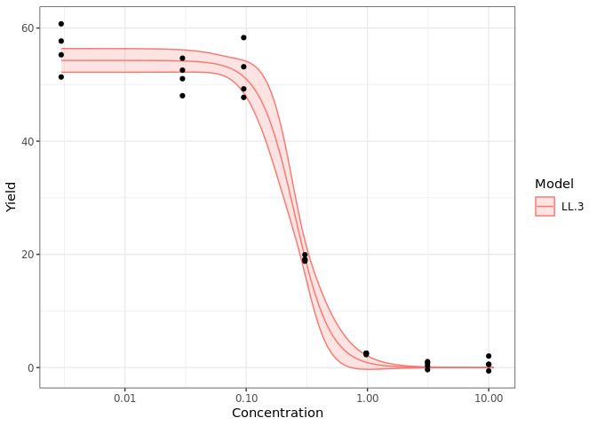
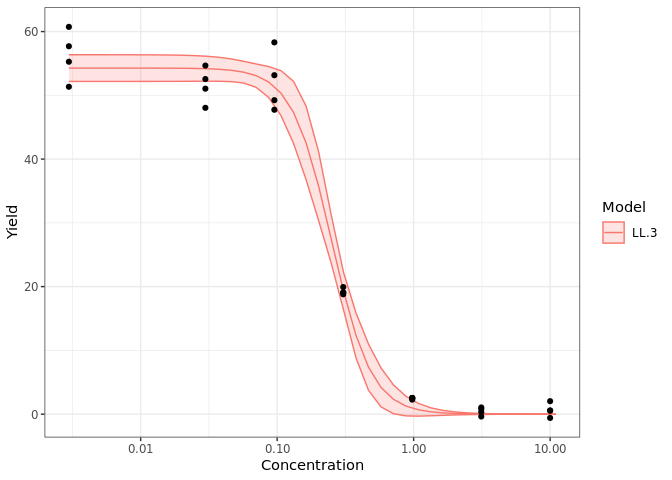

<!-- README.md is generated from README.Rmd. Please edit that file -->

# drcHelper

<!-- badges: start -->
<!-- badges: end -->

The goal of drcHelper is to …

## Installation

You can install the development version of drcHelper from
[GitHub](https://github.com/) with:

``` r
# install.packages("devtools")
devtools::install_github("bayer-int/drcHelper")
```

## Example

## Data Overview

``` r
library(drcHelper)
library(drc)
library(dplyr)
library(purrr)
library(ggplot2)
sum1 <- oecd201 %>% group_by(Time,Treatment) %>% summarise(Yield_mean=mean(Yield),Yield_sd=sd(Yield),GrowthRate_mean=mean(GrowthRate),GrowthRate_sd=sd(GrowthRate))
sum0 <- sum1%>%filter(Treatment=="Control")%>%rename(Yield0=Yield_mean,GrowthRate0=GrowthRate_mean)%>%dplyr::select(c(Time,Yield0,GrowthRate0))
# sum0
sumtab <- left_join(sum1%>%filter(Time>0),sum0) %>% mutate(Yield_Inhibition=(Yield0-Yield_mean)/Yield0*100,GrowthRate_Inhibition=(GrowthRate0-GrowthRate_mean)/GrowthRate0*100) %>% dplyr::select(c(Time,Treatment,Yield_mean,Yield_sd,Yield_Inhibition,GrowthRate_mean,GrowthRate_sd,GrowthRate_Inhibition))
```

``` r
sumtab%>%dplyr::select(c(Yield_mean,Yield_sd,Yield_Inhibition))%>%filter(Time==72)%>%knitr::kable(.,digits = 2,caption="<center><strong>Yield Summary at Time 72h<strong><center>",escape = FALSE)##%>% kableExtra::kable_styling(bootstrap_options = "striped")##%>%kableExtra::kable_classic_2()
```

Table:
<center>
<strong>Yield Summary at Time 72h<strong>
<center>

| Time | Yield_mean | Yield_sd | Yield_Inhibition |
|-----:|-----------:|---------:|-----------------:|
|   72 |      56.26 |     3.97 |             0.00 |
|   72 |      51.57 |     2.79 |             8.33 |
|   72 |      52.11 |     4.72 |             7.38 |
|   72 |      19.22 |     0.49 |            65.84 |
|   72 |       2.47 |     0.13 |            95.61 |
|   72 |       0.45 |     0.62 |            99.20 |
|   72 |       0.64 |     1.07 |            98.86 |

``` r
sumtab%>%dplyr::select(c(GrowthRate_mean,GrowthRate_sd,GrowthRate_Inhibition))%>%filter(Time==72)%>%knitr::kable(.,digits = 2,caption="<center><strong>Growth Rate Summary at Time 72h<strong><center>",escape = FALSE)##%>%kableExtra::kable_classic()
```

Table:
<center>
<strong>Growth Rate Summary at Time 72h<strong>
<center>

| Time | GrowthRate_mean | GrowthRate_sd | GrowthRate_Inhibition |
|-----:|----------------:|--------------:|----------------------:|
|   72 |            1.35 |          0.02 |                  0.00 |
|   72 |            1.32 |          0.02 |                  2.09 |
|   72 |            1.32 |          0.03 |                  1.89 |
|   72 |            1.00 |          0.01 |                 25.69 |
|   72 |            0.41 |          0.01 |                 69.25 |
|   72 |            0.09 |          0.18 |                 93.04 |
|   72 |            0.09 |          0.28 |                 93.16 |

## Model Fitting and Comparison For Yield

``` r
datTn<- subset(oecd201,Time==72)

mod <- drm(Yield~Concentration,data=datTn,fct=LL.3())
fctList <- list(LL2.3(),W2.3(),W1.3(),EXD.3(),EXD.2(),LN.3(),W2.4(),LL.4(),LL2.4())
plot(mod,type="all")
```


``` r
res <- mselect.plus(mod,fctList = fctList )
modList <- res$modList
edResTab <- mselect.ED(modList = modList,respLev = c(10,20,50),trend=datTn$Trend_Yield[1])
plot.edList(edResTab)
```


``` r
resComp <- drcCompare(modRes = res,trend="Decrease")
```

``` r
knitr::kable(edResTab,caption = "14 day TSL Yield",digits = 3)
```

| .id   | Estimate | Std. Error | Lower | Upper |    NW | Rating | EC    |
|:------|---------:|-----------:|------:|------:|------:|:-------|:------|
| W2.3  |    0.121 |      0.015 | 0.090 | 0.152 | 0.509 | Fair   | EC 10 |
| W2.3  |    0.148 |      0.015 | 0.117 | 0.179 | 0.419 | Good   | EC 20 |
| W2.3  |    0.236 |      0.014 | 0.207 | 0.265 | 0.243 | Good   | EC 50 |
| LL.3  |    0.120 |      0.020 | 0.078 | 0.162 | 0.700 | Fair   | EC 10 |
| LL.3  |    0.158 |      0.019 | 0.118 | 0.197 | 0.504 | Fair   | EC 20 |
| LL.3  |    0.251 |      0.013 | 0.225 | 0.277 | 0.206 | Good   | EC 50 |
| LL2.3 |    0.120 |         NA | 0.085 | 0.170 | 0.714 | Fair   | EC 10 |
| LL2.3 |    0.158 |         NA | 0.123 | 0.203 | 0.509 | Fair   | EC 20 |
| LL2.3 |    0.251 |         NA | 0.226 | 0.278 | 0.207 | Good   | EC 50 |
| W2.4  |    0.122 |      0.016 | 0.088 | 0.156 | 0.556 | Fair   | EC 10 |
| W2.4  |    0.148 |      0.016 | 0.115 | 0.182 | 0.451 | Good   | EC 20 |
| W2.4  |    0.236 |      0.015 | 0.206 | 0.267 | 0.259 | Good   | EC 50 |
| LL.4  |    0.126 |      0.023 | 0.078 | 0.173 | 0.759 | Fair   | EC 10 |
| LL.4  |    0.162 |      0.021 | 0.118 | 0.207 | 0.546 | Fair   | EC 20 |
| LL.4  |    0.252 |      0.013 | 0.225 | 0.280 | 0.218 | Good   | EC 50 |
| LL2.4 |    0.126 |         NA | 0.086 | 0.184 | 0.777 | Fair   | EC 10 |
| LL2.4 |    0.162 |         NA | 0.124 | 0.213 | 0.552 | Fair   | EC 20 |
| LL2.4 |    0.252 |         NA | 0.226 | 0.281 | 0.219 | Good   | EC 50 |
| LN.3  |    0.120 |      0.019 | 0.082 | 0.158 | 0.639 | Fair   | EC 10 |
| LN.3  |    0.154 |      0.018 | 0.118 | 0.191 | 0.474 | Good   | EC 20 |
| LN.3  |    0.249 |      0.012 | 0.223 | 0.274 | 0.203 | Good   | EC 50 |
| W1.3  |    0.135 |      0.032 | 0.068 | 0.201 | 0.987 | Fair   | EC 10 |
| W1.3  |    0.176 |      0.029 | 0.117 | 0.235 | 0.671 | Fair   | EC 20 |
| W1.3  |    0.264 |      0.013 | 0.237 | 0.292 | 0.210 | Good   | EC 50 |
| EXD.2 |    0.035 |      0.003 | 0.028 | 0.041 | 0.378 | Good   | EC 10 |
| EXD.2 |    0.074 |      0.007 | 0.060 | 0.087 | 0.378 | Good   | EC 20 |
| EXD.2 |    0.229 |      0.021 | 0.185 | 0.272 | 0.378 | Good   | EC 50 |
| EXD.3 |    0.035 |      0.004 | 0.027 | 0.042 | 0.435 | Good   | EC 10 |
| EXD.3 |    0.074 |      0.008 | 0.058 | 0.090 | 0.435 | Good   | EC 20 |
| EXD.3 |    0.229 |      0.024 | 0.179 | 0.278 | 0.435 | Good   | EC 50 |

14 day TSL Yield

``` r
knitr::kable(resComp,caption = "14 day TSL Yield, Model Comparison",digits = 3)
```

|       |  logLik |      IC | Lack of fit | Res var | Certainty_Protection | Steepness | No Effect p-val |
|:------|--------:|--------:|------------:|--------:|:---------------------|:----------|----------------:|
| W2.3  | -66.456 | 140.912 |       0.188 |   7.556 | Medium               | Medium    |               0 |
| LL.3  | -67.245 | 142.489 |       0.117 |   7.994 | Medium               | Medium    |               0 |
| LL2.3 | -67.245 | 142.489 |       0.117 |   7.994 | High                 | Medium    |               0 |
| W2.4  | -66.433 | 142.866 |       0.113 |   7.858 | Medium               | Medium    |               0 |
| LL.4  | -66.584 | 143.169 |       0.102 |   7.943 | Medium               | Medium    |               0 |
| LL2.4 | -66.584 | 143.169 |       0.102 |   7.943 | Medium               | Medium    |               0 |
| LN.3  | -67.745 | 143.490 |       0.086 |   8.284 | Medium               | Medium    |               0 |
| W1.3  | -68.086 | 144.173 |       0.069 |   8.489 | Medium               | Medium    |               0 |
| EXD.2 | -80.603 | 167.207 |       0.000 |  19.958 | High                 | Shallow   |               0 |
| EXD.3 | -80.603 | 169.207 |       0.000 |  20.756 | High                 | Shallow   |               0 |

14 day TSL Yield, Model Comparison

``` r
plot.modList(modList,scale="logx")
```

<div class="figure">


<p class="caption">
Yield Model Fits
</p>

</div>

``` r
plot.modList(modList[c(1,2,3,4)],scale="logx",npts=40)
```



``` r
p <-plot.modList(modList[c(1)],scale="logx",npts=80)+theme(legend.position = "none")+ggtitle("14 day Total Shoot Length, \n3-parameter type II Weibull Model Fit")
addECxCI(p=p,object=modList[[1]],EDres=NULL,trend="Decrease",endpoint="EC", respLev=c(10,20,50),
                     textAjust.x=0.01,textAjust.y=1,useObsCtr=FALSE,d0=NULL,textsize = 4,lineheight = 1,xmin=0.012)+ylab("Total Shoot Length [cm]") + xlab("Concentration [µg a.s./L]")
```


``` r
ggsave("TSL_14d_Yield.png")
```

``` r
resED <- t(edResTab[1:3, c(2,4,5,6)])
colnames(resED) <- paste("EC", c(10,20,50))
knitr::kable(resED,caption = "Total Shoot Length Growth Yield at 14 day",digits = 3)
```

|          | EC 10 | EC 20 | EC 50 |
|:---------|------:|------:|------:|
| Estimate | 0.121 | 0.148 | 0.236 |
| Lower    | 0.090 | 0.117 | 0.207 |
| Upper    | 0.152 | 0.179 | 0.265 |
| NW       | 0.509 | 0.419 | 0.243 |

Total Shoot Length Growth Yield at 14 day

``` r

mod <-modList[[1]]
edres <- ED.plus(mod,c(5,10,20,50),trend="Decrease")
pander::pander(as.data.frame(edres))
```

|           | Estimate | Std. Error |  Lower  | Upper  |
|:---------:|:--------:|:----------:|:-------:|:------:|
| **EC 5**  |  0.1044  |  0.01464   | 0.0743  | 0.1346 |
| **EC 10** |  0.1209  |  0.01494   | 0.09017 | 0.1517 |
| **EC 20** |  0.1477  |  0.01501   | 0.1167  | 0.1786 |
| **EC 50** |  0.2361  |  0.01395   | 0.2074  | 0.2649 |

``` r
modsum <- summary(mod)
pander::pander(coef(modsum))
```

|                   | Estimate | Std. Error | t-value |  p-value  |
|:-----------------:|:--------:|:----------:|:-------:|:---------:|
| **b:(Intercept)** |  -1.794  |   0.2203   | -8.144  | 1.696e-08 |
| **d:(Intercept)** |  53.85   |   0.9535   |  56.48  | 3.42e-28  |
| **e:(Intercept)** |  0.1925  |  0.01447   |  13.3   | 7.664e-13 |

## ToDo

- [ ] Develop all NOEC functions
- [ ] Prepare the templates.
