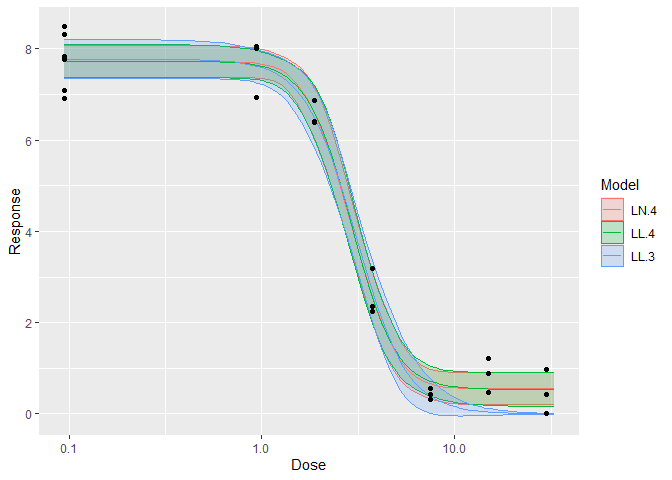

<!-- README.md is generated from README.Rmd. Please edit that file -->

# drcHelper

<!-- badges: start -->

[](https://github.com/Bayer-Group/drcHelper/actions/workflows/R-CMD-check.yaml)
<!-- badges: end -->

The goal of **drcHelper** is to assist with routine dose-response
analysis by providing a collection of helper functions and standalone
functions that are generic and may be useful beyond our organization.

As part of the GLP stat pilot project, this package serves as a
cornerstone for the second use case, EFX Statistics. It will streamline
GLP statistical analyses for various dose-response studies and test
assays within our registration data package. This ensures that the
analyses remain current, state-of-the-art, and flexible enough to adapt
to new regulatory requirements while complying with GLP standards.

The package also includes test cases and examples to help the regulatory
statistical community understand the reasons behind different outcomes.
For instance, point estimations and p-values may vary depending on the
parties involved, the functions used, or the packages selected. It aims
to promote a harmonized understanding of methodologies and provide a
foundation for standardized practices in the regulatory statistics field
for plant protection product registration. Additionally, it is hoped
that this project will contribute to the ongoing OECD 54 revision
process.

Some of the functions are adapted from archived packages or single
functions of a bigger package so that the loaded namespace is not too
big for small calculations. Some of the functions are included for
testing and validation purposes. All third-party code with a different
license are specified in the relevant source files with the license name
and the relevant copyright texts.

This package is open source, and any contributions or improvements,
especially on the documentation side, are welcome.

*Please note that the documentation website for this package is
currently under development. Some articles are still placeholders, and
many more are on the way. However, the ongoing development of the
website does not impact the usage of this R package. *

## Installation

You can install the development version of drcHelper from
[GitHub](https://github.com/) with:

``` r
# install.packages("devtools")
devtools::install_github("Bayer-Group/drcHelper")
```

or

``` r
# install.packages("pak")
pak::pak("Bayer-Group/drcHelper")
```

## Example

## Data Overview

## Preliminary Summary

``` r
library(drcHelper)
```

``` r
data("dat_medium")
dat_medium <- dat_medium %>% mutate(Treatment=factor(Dose,levels=unique(Dose))) 
dat_medium$Response[dat_medium$Response < 0] <- 0
prelimPlot3(dat_medium)
```


``` r
prelimSummary(dat_medium) %>% knitr::kable(.,digits = 3)
```

|  Dose |  Mean |    SD | % Inhibition |      CV |
|------:|------:|------:|-------------:|--------:|
|  0.00 | 7.736 | 0.635 |        0.000 |   8.203 |
|  0.94 | 7.669 | 0.633 |        0.858 |   8.259 |
|  1.88 | 6.563 | 0.275 |       15.161 |   4.197 |
|  3.75 | 2.596 | 0.524 |       66.440 |  20.175 |
|  7.50 | 0.429 | 0.128 |       94.456 |  29.865 |
| 15.00 | 0.859 | 0.372 |       88.892 |  43.296 |
| 30.00 | 0.465 | 0.485 |       93.984 | 104.162 |

## Fitting multiple models and rank them.

``` r
mod <- drm(Response~Dose,data=dat_medium,fct=LL.3())
fctList <- list(LN.4(),LL.4(),W1.3(),LL2.2())
# plot(mod,type="all")
res <- mselect.plus(mod,fctList = fctList )
modList <- res$modList
res$Comparison
#>          logLik        IC  Lack of fit    Res var
#> LN.4  -14.65361  39.30722 6.118094e-01  0.2382532
#> LL.4  -14.94568  39.89136 5.241523e-01  0.2441232
#> LL.3  -19.24379  46.48759 6.848925e-02  0.3326394
#> W1.3  -20.46060  48.92121 3.233853e-02  0.3681387
#> LL2.2 -70.78500 147.57000 5.059273e-17 23.2867452

drcCompare(modRes=res)
#>          logLik        IC  Lack of fit    Res var Certainty_Protection
#> LN.4  -14.65361  39.30722 6.118094e-01  0.2382532                 High
#> LL.4  -14.94568  39.89136 5.241523e-01  0.2441232                 High
#> LL.3  -19.24379  46.48759 6.848925e-02  0.3326394                 High
#> W1.3  -20.46060  48.92121 3.233853e-02  0.3681387               Medium
#> LL2.2 -70.78500 147.57000 5.059273e-17 23.2867452                  Low
#>       Steepness No Effect p-val
#> LN.4     Medium               0
#> LL.4     Medium               0
#> LL.3     Medium               0
#> W1.3     Medium               0
#> LL2.2     Steep               1
```

``` r
library(purrr)
edResTab <- mselect.ED(modList = modList,respLev = c(10,20,50),trend="Decrease",CI="inv")
edResTab
#>      .id Estimate Std. Error    Lower    Upper        NW      Rating    EC
#> 1   LN.4 1.700983         NA 1.473332 1.981769 0.2989080        Good EC 10
#> 2   LN.4 2.067640         NA 1.826100 2.313691 0.2358199        Good EC 20
#> 3   LN.4 3.032171         NA 2.791669 3.273468 0.1588958   Excellent EC 50
#> 4   LL.4 1.684436         NA 1.432457 2.010475 0.3431522        Good EC 10
#> 5   LL.4 2.085759         NA 1.822344 2.363961 0.2596737        Good EC 20
#> 6   LL.4 3.037362         NA 2.775132 3.288824 0.1691243   Excellent EC 50
#> 7   LL.3 1.577779         NA 1.284085 1.961887 0.4295925        Good EC 10
#> 8   LL.3 2.019269         NA 1.705807 2.342361 0.3152395        Good EC 20
#> 9   LL.3 3.078551         NA 2.783875 3.366535 0.1892643   Excellent EC 50
#> 10  W1.3 1.588647         NA 1.208777 2.089897 0.5546351        Fair EC 10
#> 11  W1.3 2.092302         NA 1.688186 2.490045 0.3832427        Good EC 20
#> 12  W1.3 3.171499         NA 2.862468 3.435822 0.1807832   Excellent EC 50
#> 13 LL2.2       NA         NA       NA       NA        NA Not defined EC 10
#> 14 LL2.2       NA         NA       NA       NA        NA Not defined EC 20
#> 15 LL2.2       NA         NA       NA       NA        NA Not defined EC 50
```

## Plot multiple models together

``` r
p <- plot.modList(modList[1:3])
p
```



## Adding ECx and ECx CI’s to the plots

``` r
p1 <- plot.modList(modList[1])
addECxCI(p1,object=modList[[1]],EDres=NULL,trend="Decrease",endpoint="EC", respLev=c(10,20,50),
                     textAjust.x=0.01,textAjust.y=0.3,useObsCtr=FALSE,d0=NULL,textsize = 4,lineheight = 0.5,xmin=0.012)+ ylab("Response Variable [unit]") + xlab("Concentration [µg a.s./L]")
```


``` r
## addECxCI(p)
```

## Report ECx

``` r
resED <- t(edResTab[1:3, c(2,4,5,6)])
colnames(resED) <- paste("EC", c(10,20,50))
knitr::kable(resED,caption = "Response Variable at day N",digits = 3)
```

|          | EC 10 | EC 20 | EC 50 |
|:---------|------:|------:|------:|
| Estimate | 1.701 | 2.068 | 3.032 |
| Lower    | 1.473 | 1.826 | 2.792 |
| Upper    | 1.982 | 2.314 | 3.273 |
| NW       | 0.299 | 0.236 | 0.159 |

Response Variable at day N

**Calculate specific ECx: **

``` r
mod <-modList[[1]]
edres <- ED.plus(mod,c(5,10,20,50),trend="Decrease")
edres%>%knitr::kable(.,digits = 3)
```

|       | Estimate | Std. Error | Lower | Upper |
|:------|---------:|-----------:|------:|------:|
| EC 5  |    1.449 |      0.157 | 1.122 | 1.777 |
| EC 10 |    1.701 |      0.154 | 1.380 | 2.022 |
| EC 20 |    2.068 |      0.146 | 1.764 | 2.371 |
| EC 50 |    3.032 |      0.147 | 2.725 | 3.340 |

## Model Output

``` r
modsum <- summary(mod)
knitr::kable(coef(modsum),digits = 3)
```

|               | Estimate | Std. Error | t-value | p-value |
|:--------------|---------:|-----------:|--------:|--------:|
| b:(Intercept) |   -2.311 |      0.299 |  -7.719 |   0.000 |
| c:(Intercept) |    0.556 |      0.171 |   3.256 |   0.004 |
| d:(Intercept) |    7.719 |      0.168 |  46.004 |   0.000 |
| e:(Intercept) |    2.907 |      0.143 |  20.382 |   0.000 |

## GitHub Actions

1.  R-CMD-check.yaml: This triggers when:

- A pull request is opened that targets any branch matching the pattern
  releases/\*\*
- This includes branches like releases/v1.0, releases/beta,
  releases/hotfix, etc.
- It will NOT trigger for PRs targeting main or master
- workflow_dispatch: This allows manual triggering of the workflow from
  the GitHub Actions tab.

This workflow will only run when working with release branches, not
during normal development on main. If you want it to run on regular
development, you’ll need to change the branch patterns.

2.  pkgdown.yaml: This triggers when

- whenever a pull request event occurs.
- when a GitHub release event occurs, but only for the specific type
  published.
- when pushed to dev.

## ToDo

- [ ] Develop all test cases for NOEC functions
- [ ] Prepare the templates and standard outputs for all .
- [ ] Update the documentation.

## Contribution Notes

- If a code space is used, Use ‘postCreateCommand’ to run commands after
  the container is created. It is rather fast.
  `"postCreateCommand": "R -q -e 'install.packages("tidyverse")'"`,
- Please create a pull request to contribute to the development of
  packages. Note that source branch is the branch you are currently
  working on when you run the `gh pr create` command.

<!-- -->

    gh pr create --title "Title of the pull request" --body "Description of the pull request"
    gh pr create --title "Title of the pull request" --body "Description of the pull request" --base develop

To use the pkgdown github workflow, some of the vignettes need to be
pre-knit before pushing to the remote github repository if extra
packages are needed and you don’s want to add those to the workflow. An
example is given below.

``` r
knitr::knit("vignettes/drcHelper.Rmd.orig", output = "vignettes/drcHelper.Rmd",fi)
```

## Acknowledgements

The work is supported by Bayer Environment Effects team members,
especially by Andreas Solga and Daniela Jans. The Mesocosm colleagues
Sarah Baumert and Harald Schulz have supported the verification and
validation with extensive examples and scripts and SAS / VB validated
calculations. Discussions with the Bayer RS-stats group, ecotox stats
core group and members of the CLE stats group regarding current
practices and statistical principles have been extremely helpful.
