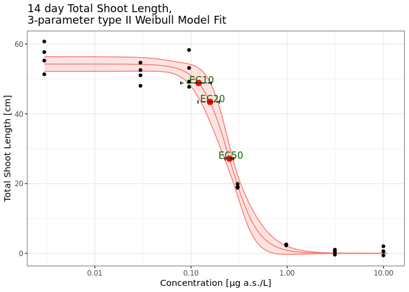

<!-- README.md is generated from README.Rmd. Please edit that file -->

# drcHelper

<!-- badges: start -->
<!-- badges: end -->

The goal of drcHelper is to assist with routine dose-response analysis
by providing a collection of helper functions and standalone functions
that are generic and may be useful beyond our organization.

As part of the GLP stat pilot project, this package serves as a
cornerstone for the second use case, EFX Statistics. It will streamline
GLP statistical analyses for various dose-response studies and test
assays within our registration data package. This ensures that the
analyses remain current, state-of-the-art, and flexible enough to adapt
to new regulatory requirements while complying with GLP standards.

The package also includes test cases and examples to help the regulatory
statistical community understand the reasons behind different outcomes.
For instance, point estimations and p-values may vary depending on the
parties involved, the functions used, or the packages selected. It aims
to promote a harmonized understanding of methodologies and provide a
foundation for standardized practices in the regulatory statistics field
for plant protection product registration. Additionally, it is hoped
that this project will contribute to the ongoing OECD 54 revision
process.

## Installation

You can install the development version of drcHelper from
[GitHub](https://github.com/) with:

``` r
# install.packages("devtools")
devtools::install_github("bayer-int/drcHelper")
```

## Example

## Data Overview

``` r
library(drcHelper)
library(drc)
library(dplyr)
library(purrr)
library(ggplot2)
theme_set(theme_bw())
sum1 <- oecd201 %>% group_by(Time,Treatment) %>% summarise(Yield_mean=mean(Yield),Yield_sd=sd(Yield),GrowthRate_mean=mean(GrowthRate),GrowthRate_sd=sd(GrowthRate))
sum0 <- sum1%>%filter(Treatment=="Control")%>%rename(Yield0=Yield_mean,GrowthRate0=GrowthRate_mean)%>%dplyr::select(c(Time,Yield0,GrowthRate0))
# sum0
sumtab <- left_join(sum1%>%filter(Time>0),sum0) %>% mutate(Yield_Inhibition=(Yield0-Yield_mean)/Yield0*100,GrowthRate_Inhibition=(GrowthRate0-GrowthRate_mean)/GrowthRate0*100) %>% dplyr::select(c(Time,Treatment,Yield_mean,Yield_sd,Yield_Inhibition,GrowthRate_mean,GrowthRate_sd,GrowthRate_Inhibition))
```

``` r
sumtab%>%dplyr::select(c(Yield_mean,Yield_sd,Yield_Inhibition))%>%filter(Time==72)%>%knitr::kable(.,digits = 2,caption="<center><strong>Yield Summary at Time 72h<strong><center>",escape = FALSE)##%>% kableExtra::kable_styling(bootstrap_options = "striped")##%>%kableExtra::kable_classic_2()
```

Table:
<center>
<strong>Yield Summary at Time 72h<strong>
<center>

| Time | Yield_mean | Yield_sd | Yield_Inhibition |
|-----:|-----------:|---------:|-----------------:|
|   72 |      56.26 |     3.97 |             0.00 |
|   72 |      51.57 |     2.79 |             8.33 |
|   72 |      52.11 |     4.72 |             7.38 |
|   72 |      19.22 |     0.49 |            65.84 |
|   72 |       2.47 |     0.13 |            95.61 |
|   72 |       0.45 |     0.62 |            99.20 |
|   72 |       0.64 |     1.07 |            98.86 |

``` r
sumtab%>%dplyr::select(c(GrowthRate_mean,GrowthRate_sd,GrowthRate_Inhibition))%>%filter(Time==72)%>%knitr::kable(.,digits = 2,caption="<center><strong>Growth Rate Summary at Time 72h<strong><center>",escape = FALSE)##%>%kableExtra::kable_classic()
```

Table:
<center>
<strong>Growth Rate Summary at Time 72h<strong>
<center>

| Time | GrowthRate_mean | GrowthRate_sd | GrowthRate_Inhibition |
|-----:|----------------:|--------------:|----------------------:|
|   72 |            1.35 |          0.02 |                  0.00 |
|   72 |            1.32 |          0.02 |                  2.09 |
|   72 |            1.32 |          0.03 |                  1.89 |
|   72 |            1.00 |          0.01 |                 25.69 |
|   72 |            0.41 |          0.01 |                 69.25 |
|   72 |            0.09 |          0.18 |                 93.04 |
|   72 |            0.09 |          0.28 |                 93.16 |

## Model Fitting and Comparison For Yield

``` r
datTn<- subset(oecd201,Time==72)

mod <- drm(Yield~Concentration,data=datTn,fct=LL.3())
fctList <- list(LL2.3(),W2.3(),W1.3(),EXD.3(),EXD.2(),LN.3(),W2.4(),LL.4(),LL2.4())
plot(mod,type="all")
```


``` r
res <- mselect.plus(mod,fctList = fctList )
#> [1] "Model not Converged, Please consult a statistician."
#> [1] "Model not Converged, Please consult a statistician."
#> [1] "Model not Converged, Please consult a statistician."
#> [1] "Model not Converged, Please consult a statistician."
#> [1] "Model not Converged, Please consult a statistician."
#> [1] "Model not Converged, Please consult a statistician."
#> [1] "Model not Converged, Please consult a statistician."
#> [1] "Model not Converged, Please consult a statistician."
#> [1] "Model not Converged, Please consult a statistician."
modList <- res$modList
edResTab <- mselect.ED(modList = modList,respLev = c(10,20,50),trend=datTn$Trend_Yield[1])
plot.edList(edResTab)
```


``` r
resComp <- drcCompare(modRes = res,trend="Decrease")
```

``` r
knitr::kable(edResTab,caption = "14 day TSL Yield",digits = 3)
```

| .id   | Estimate | Std. Error | Lower | Upper |    NW | Rating      | EC    |
|:------|---------:|-----------:|------:|------:|------:|:------------|:------|
| LL.3  |    0.120 |      0.020 | 0.078 | 0.162 | 0.700 | Fair        | EC 10 |
| LL.3  |    0.158 |      0.019 | 0.118 | 0.197 | 0.504 | Fair        | EC 20 |
| LL.3  |    0.251 |      0.013 | 0.225 | 0.277 | 0.206 | Good        | EC 50 |
| LL2.3 |       NA |         NA |    NA |    NA |    NA | Not defined | EC 10 |
| LL2.3 |       NA |         NA |    NA |    NA |    NA | Not defined | EC 20 |
| LL2.3 |       NA |         NA |    NA |    NA |    NA | Not defined | EC 50 |
| W2.3  |       NA |         NA |    NA |    NA |    NA | Not defined | EC 10 |
| W2.3  |       NA |         NA |    NA |    NA |    NA | Not defined | EC 20 |
| W2.3  |       NA |         NA |    NA |    NA |    NA | Not defined | EC 50 |
| W1.3  |       NA |         NA |    NA |    NA |    NA | Not defined | EC 10 |
| W1.3  |       NA |         NA |    NA |    NA |    NA | Not defined | EC 20 |
| W1.3  |       NA |         NA |    NA |    NA |    NA | Not defined | EC 50 |
| EXD.3 |       NA |         NA |    NA |    NA |    NA | Not defined | EC 10 |
| EXD.3 |       NA |         NA |    NA |    NA |    NA | Not defined | EC 20 |
| EXD.3 |       NA |         NA |    NA |    NA |    NA | Not defined | EC 50 |
| EXD.2 |       NA |         NA |    NA |    NA |    NA | Not defined | EC 10 |
| EXD.2 |       NA |         NA |    NA |    NA |    NA | Not defined | EC 20 |
| EXD.2 |       NA |         NA |    NA |    NA |    NA | Not defined | EC 50 |
| LN.3  |       NA |         NA |    NA |    NA |    NA | Not defined | EC 10 |
| LN.3  |       NA |         NA |    NA |    NA |    NA | Not defined | EC 20 |
| LN.3  |       NA |         NA |    NA |    NA |    NA | Not defined | EC 50 |
| W2.4  |       NA |         NA |    NA |    NA |    NA | Not defined | EC 10 |
| W2.4  |       NA |         NA |    NA |    NA |    NA | Not defined | EC 20 |
| W2.4  |       NA |         NA |    NA |    NA |    NA | Not defined | EC 50 |
| LL.4  |       NA |         NA |    NA |    NA |    NA | Not defined | EC 10 |
| LL.4  |       NA |         NA |    NA |    NA |    NA | Not defined | EC 20 |
| LL.4  |       NA |         NA |    NA |    NA |    NA | Not defined | EC 50 |
| LL2.4 |       NA |         NA |    NA |    NA |    NA | Not defined | EC 10 |
| LL2.4 |       NA |         NA |    NA |    NA |    NA | Not defined | EC 20 |
| LL2.4 |       NA |         NA |    NA |    NA |    NA | Not defined | EC 50 |

14 day TSL Yield

``` r
knitr::kable(resComp,caption = "14 day TSL Yield, Model Comparison",digits = 3)
```

|       |  logLik |      IC | Lack of fit | Res var | Certainty_Protection | Steepness | No Effect p-val |
|:------|--------:|--------:|------------:|--------:|:---------------------|:----------|----------------:|
| LL.3  | -67.245 | 142.489 |       0.117 |   7.994 | Medium               | Medium    |               0 |
| LL2.3 |      NA |      NA |          NA |      NA | NA                   | NA        |              NA |
| W2.3  |      NA |      NA |          NA |      NA | NA                   | NA        |              NA |
| W1.3  |      NA |      NA |          NA |      NA | NA                   | NA        |              NA |
| EXD.3 |      NA |      NA |          NA |      NA | NA                   | NA        |              NA |
| EXD.2 |      NA |      NA |          NA |      NA | NA                   | NA        |              NA |
| LN.3  |      NA |      NA |          NA |      NA | NA                   | NA        |              NA |
| W2.4  |      NA |      NA |          NA |      NA | NA                   | NA        |              NA |
| LL.4  |      NA |      NA |          NA |      NA | NA                   | NA        |              NA |
| LL2.4 |      NA |      NA |          NA |      NA | NA                   | NA        |              NA |

14 day TSL Yield, Model Comparison

``` r
plot.modList(modList,scale="logx")
```

<div class="figure">


<p class="caption">
Yield Model Fits
</p>

</div>

``` r
plot.modList(modList[c(1,2,3,4)],scale="logx",npts=40)
```


``` r
p <-plot.modList(modList[c(1)],scale="logx",npts=80)+theme(legend.position = "none")+ggtitle("14 day Total Shoot Length, \n3-parameter type II Weibull Model Fit")
addECxCI(p=p,object=modList[[1]],EDres=NULL,trend="Decrease",endpoint="EC", respLev=c(10,20,50),
                     textAjust.x=0.01,textAjust.y=1,useObsCtr=FALSE,d0=NULL,textsize = 4,lineheight = 1,xmin=0.012)+ylab("Total Shoot Length [cm]") + xlab("Concentration [µg a.s./L]")
```



``` r
## ggsave("TSL_14d_Yield.png")
```

``` r
resED <- t(edResTab[1:3, c(2,4,5,6)])
colnames(resED) <- paste("EC", c(10,20,50))
knitr::kable(resED,caption = "Total Shoot Length Growth Yield at 14 day",digits = 3)
```

|          | EC 10 | EC 20 | EC 50 |
|:---------|------:|------:|------:|
| Estimate | 0.120 | 0.158 | 0.251 |
| Lower    | 0.078 | 0.118 | 0.225 |
| Upper    | 0.162 | 0.197 | 0.277 |
| NW       | 0.700 | 0.504 | 0.206 |

Total Shoot Length Growth Yield at 14 day

``` r

mod <-modList[[1]]
edres <- ED.plus(mod,c(5,10,20,50),trend="Decrease")
pander::pander(as.data.frame(edres))
```

|           | Estimate | Std. Error |  Lower  | Upper  |
|:---------:|:--------:|:----------:|:-------:|:------:|
| **EC 5**  | 0.09351  |  0.02005   | 0.05222 | 0.1348 |
| **EC 10** |  0.1201  |  0.02041   | 0.07812 | 0.1622 |
| **EC 20** |  0.1577  |  0.01929   |  0.118  | 0.1974 |
| **EC 50** |  0.251   |  0.01258   | 0.2251  | 0.2769 |

``` r
modsum <- summary(mod)
pander::pander(coef(modsum))
```

|                   | Estimate | Std. Error | t-value |  p-value  |
|:-----------------:|:--------:|:----------:|:-------:|:---------:|
| **b:(Intercept)** |  2.982   |   0.5414   |  5.508  | 1.008e-05 |
| **d:(Intercept)** |  54.27   |   1.017    |  53.37  | 1.391e-27 |
| **e:(Intercept)** |  0.251   |  0.01258   |  19.95  | 3.579e-17 |

## ToDo

- [ ] Develop all test cases for NOEC functions
- [ ] Prepare the templates and standard outputs for all .
- [ ] Update the documentation.

## Contribution Notes

- Please create a pull request to contribute to the development of
  packages. Note that source branch is the branch you are currently
  working on when you run the `gh pr create` command.

<!-- -->

    gh pr create --title "Title of the pull request" --body "Description of the pull request"
    gh pr create --title "Title of the pull request" --body "Description of the pull request" --base develop

To use the pkgdown github workflow, some of the vignettes need to be
pre-knit before pushing to the remote github repository.

``` r
knitr::knit("vignettes/drcHelper.Rmd.orig", output = "vignettes/drcHelper.Rmd")
knitr::knit("vignettes/articles/Example_RSCABS.Rmd.orig", output = "vignettes/articles/Example_RSCABS.Rmd")
knitr::knit("vignettes/articles/Examples using NLS.Rmd.orig", output = "vignettes/articles/Examples using NLS.Rmd")
knitr::knit("vignettes/articles/Examples_drc.Rmd.orig", output = "vignettes/articles/Examples_drc.Rmd")
knitr::knit("vignettes/articles/Examples_oecd201.Rmd.orig", output = "vignettes/articles/Examples_oecd201.Rmd")
```
