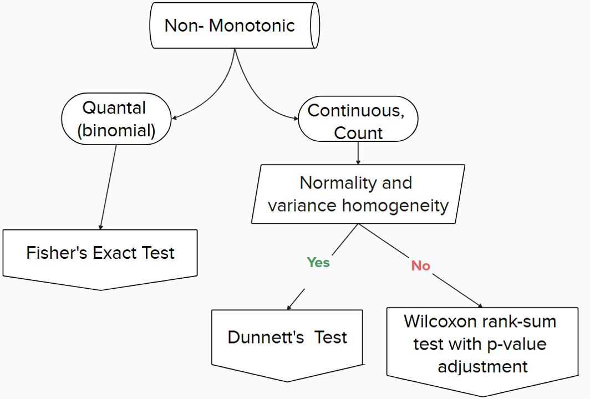

```{r, include = FALSE}
knitr::opts_chunk$set(
  collapse = TRUE,
  comment = "#>",
  warning = FALSE,
  message = FALSE
)
library(tidyverse)
```

```{r}
library(drcHelper)
```

Analyis of quantal data typically involves the following steps as shown in the flowchart below:


```{r}

```

## An example dataset

```{r}
library(rstatix)
library(dplyr)
library(tidyr)

# Generate data
set.seed(123)
doses <- c(0, 0.1, 1, 10, 50, 100)
reps <- 4

# Generate counts with dose-response relationship
data <- data.frame(
  dose = rep(doses, each = reps),
  replicate = rep(1:reps, times = length(doses))
)

# Generate response counts (out of 10 organisms per replicate)
data$alive <- sapply(data$dose, function(x) {
  rbinom(1, 10, prob = exp(-0.02 * x))
})
data$dead <- 10 - data$alive

# Reshape for analysis
data_long <- tidyr::gather(data, condition, count, alive:dead)
```

## Fisher's Exact Test (comparing each dose to control)

```{r}
# Fisher's Exact Test (comparing each dose to control)
fisher_results <- data.frame(dose = unique(data$dose)[-1], 
                           p_value = NA)

for(d in unique(data$dose)[-1]) {
  test_data <- data[data$dose %in% c(0, d), ]
  test <- fisher.test(matrix(c(sum(test_data$alive[test_data$dose == 0]),
                              sum(test_data$dead[test_data$dose == 0]),
                              sum(test_data$alive[test_data$dose == d]),
                              sum(test_data$dead[test_data$dose == d])),
                            nrow = 2))
  fisher_results$p_value[fisher_results$dose == d] <- test$p.value
}

## check against rstatix

## pairwise_fisher_test(,p.adjust.method = "none")
```


```{r eval=FALSE}
# CMH test
cmh_result <- data_long %>%
  group_by(dose, condition) %>%
  summarise(n = sum(count)) %>%
  stats::mantelhaen.test()

# Print results
print("Fisher's Exact Test results (comparing each dose to control):")
print(fisher_results)

print("\nCochran-Mantel-Haenszel Test result:")
print(cmh_result)

# Calculate NOEC
noec <- max(fisher_results$dose[fisher_results$p_value > 0.05])
```


### Cochran-Mantel-Haenszel Chi-Squared Test for Count Data

It is an extension of Cochran-Mantel test used for stratified or matched categorical data.

```{r}

```


### McNemar's Chi-squared Test for Count Data

McNemar's test was not appropriate for NOEC derivation as it's designed for paired observations (before/after measurements).

## Tarone's Test

```{r}
mymatrix1 <- matrix(c(4,5,5,103),nrow=2,byrow=TRUE)
colnames(mymatrix1) <- c("Disease","Control")
rownames(mymatrix1) <- c("Exposure","Unexposed")
mymatrix2 <- matrix(c(10,3,5,43),nrow=2,byrow=TRUE)
colnames(mymatrix2) <- c("Disease","Control")
rownames(mymatrix2) <- c("Exposure","Unexposed")
mylist <- list(mymatrix1,mymatrix2)
calcTaronesTest(mylist)
```

## Trend Test

```{r}

```

