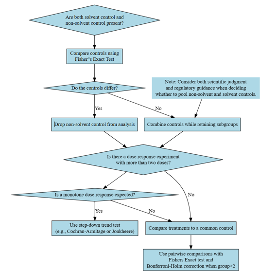

```{r, include = FALSE}
knitr::opts_chunk$set(
  collapse = TRUE,
  comment = "#>",
  warning = FALSE,
  message = FALSE
)
source("../knitr-setup.R")
library(tidyverse)
library(here)
```

```{r}
library(drcHelper)
```

Analysis of quantal data typically involves the following steps as shown in the flowchart below:

<!--  -->

```{r echo=FALSE,out.width="90%"}
#| fig.alt: >
#|   Quantal NOEC Flowchart

```

## An example dataset

```{r}
library(rstatix)
library(dplyr)
library(tidyr)

set.seed(123)
test_data <- data.frame(
  treatment = c(rep("control", 3), rep("low", 3), rep("high", 3)),
  survived = c(9, 8, 10, 7, 6, 5, 3, 4, 2),
  died = c(1, 2, 0, 3, 4, 5, 7, 6, 8)
)


```

## Fisher's Exact Test (comparing each dose to control)

Note that just two groups also work. 

```{r}
# Run the function
result <- compare_to_control_fisher(test_data, "treatment", "survived", "died",
                                    control_level = "control",p.adjust.method="holm")
result
ctab <- create_contingency_table(test_data,"treatment", "survived", "died")
drcHelper::many_to_one_fisher_test(ctab,ref.group = "treatment_control",p.adjust.method = "holm")

```

Note that with two groups, same functions can be used and the p_adjusted will always be equal to original p-value. 

```{r}
result <- compare_to_control_fisher(test_data%>%filter(treatment!="high")%>%droplevels(.), "treatment", "survived", "died",control_level = "control")
result
ctab <- create_contingency_table(test_data %>% filter(treatment!="high") %>% droplevels(.),"treatment", "survived", "died")
drcHelper::many_to_one_fisher_test(ctab,ref.group = "treatment_control",p.adjust.method = "holm")
fisher.test(ctab)
```


```{r eval=FALSE}
# CMH test
cmh_result <- data_long %>%
  group_by(dose, condition) %>%
  summarise(n = sum(count)) %>%
  stats::mantelhaen.test()

# Print results
print("Fisher's Exact Test results (comparing each dose to control):")
print(fisher_results)

print("\nCochran-Mantel-Haenszel Test result:")
print(cmh_result)

# Calculate NOEC
noec <- max(fisher_results$dose[fisher_results$p_value > 0.05])
```


## Other types of tests not used in regulatory statistical analysis in ecotoxicology

### Cochran-Mantel-Haenszel Chi-Squared Test for Count Data

It is an extension of Cochran-Mantel test used for stratified or matched categorical data.

```{r}

```


### McNemar's Chi-squared Test for Count Data

McNemar's test was not appropriate for NOEC derivation as it's designed for paired observations (before/after measurements).

## Tarone's Test

```{r}
mymatrix1 <- matrix(c(4,5,5,103),nrow=2,byrow=TRUE)
colnames(mymatrix1) <- c("Disease","Control")
rownames(mymatrix1) <- c("Exposure","Unexposed")
mymatrix2 <- matrix(c(10,3,5,43),nrow=2,byrow=TRUE)
colnames(mymatrix2) <- c("Disease","Control")
rownames(mymatrix2) <- c("Exposure","Unexposed")
mylist <- list(mymatrix1,mymatrix2)
calcTaronesTest(mylist)
```

## Trend Test

Cochran Armitage test for trend in binomial proportions across the treament levels can be performed by `prop.trend.test` or `CochranArmitageTest` from `DescTools` or use the wrapper function `prop_trend_test` provided by **rstatix** package. Step-down procedures can be performed using the helper function in this package `step_down_CA` or `step_down_RSCA`. 

The Rao-Scott correction is needed when your binomial data exhibits overdispersion, which occurs when the observed variance in the data exceeds what would be expected under a simple binomial model. This is common in:

- Clustered data: When observations within a group (like organisms in the same tank) are more similar to each other than to organisms in different groups
- Hierarchical experimental designs: When there are multiple levels of sampling (e.g., tanks within treatments, organisms within tanks)
- Longitudinal studies: When the same subjects are measured repeatedly over time
- Ecological studies: Where environmental factors create additional variability beyond what a simple binomial model predicts

Without Rao-Scott correction, it is possible to underestimate standard errors, and obtain artificially small p-values (Type I errors). 

Dispersion can be tested by many approaches. Some of them are: 
1. Calculate the dispersion parameter ($\phi$) as the ratio of the Pearson chi-square statistic to its degrees of freedom. 
2. Compare a binomial model to a quasi-binomial or beta-binomial model.
3. Dean's test for overdispersion

**DHARMa** package provides a simulation-based overdispersion test. 


Note that the Rao-Scott correction is used to deal with over-dispersion and clustered data. The `prop.trend.test` uses a $\chi^2$ statistic which is the square of $Z$ statistic used in `drcHelper::cochranArmitageTrendTest` or `DescTools::CochranArmitageTest`. Also `prop.trend.test` only gave two sided test p-values, whereas `DescTools::CochranArmitageTest` only gives one-sided or two-sided p-values and do not allow the specification of the direction. 


```{r}
library(DescTools)
test_data <- matrix(c(10,9,10,7, 0,1,0,3), byrow=TRUE, nrow=2, dimnames=list(resp=0:1, dose=0:3))
## DescTools::Desc(dose)

DescTools::CochranArmitageTest(test_data)
stats::prop.trend.test(c(10,9,10,7),rep(10,4),0:3)
drcHelper::cochranArmitageTrendTest(c(10,9,10,7),rep(10,4),0:3)
DescTools::CochranArmitageTest(test_data,alternative = "one.sided")
cochranArmitageTrendTest(c(10,9,10,7),rep(10,4),0:3,alternative = "less")
cochranArmitageTrendTest(c(10,9,10,7),rep(10,4),0:3,alternative = "greater")
```

Note this is a bit different from the `independence_test` in package **coin**. 

### An example with clustered data

```{r}
# Simulate a toxicity experiment with tank effects
set.seed(123)

# Experimental design
doses <- c(0, 1, 2, 5, 10)  # Dose levels
tanks_per_dose <- 3         # Replicate tanks per dose
organisms_per_tank <- 10    # Organisms per tank

# Create data frame
experiment <- expand.grid(
  dose = doses,
  tank = 1:tanks_per_dose
)
experiment$tank_id <- 1:nrow(experiment)

# Add random tank effect (creates correlation within tanks)
# Higher ICC_tank values create stronger clustering
ICC_tank <- 0.3  # Intraclass correlation coefficient for tank effect
tank_effect <- rnorm(nrow(experiment), mean = 0, sd = sqrt(ICC_tank/(1-ICC_tank)))

# Generate survival data with dose-response relationship and tank effect
generate_survival <- function(dose, tank_effect) {
  # Base survival probability (decreases with dose)
  p_base <- 0.9 - 0.08 * dose
  
  # Apply tank effect on logit scale
  logit_p <- log(p_base/(1-p_base)) + tank_effect
  p_with_tank <- exp(logit_p)/(1+exp(logit_p))
  
  # Generate binomial outcomes for each organism
  rbinom(organisms_per_tank, size = 1, prob = p_with_tank)
}

# Generate data for each tank
tank_data <- lapply(1:nrow(experiment), function(i) {
  survivors <- generate_survival(experiment$dose[i], tank_effect[i])
  data.frame(
    dose = experiment$dose[i],
    tank_id = experiment$tank_id[i],
    tank = experiment$tank[i],
    organism = 1:organisms_per_tank,
    survived = survivors
  )
})

# Combine all data
all_data <- do.call(rbind, tank_data)

# Summarize by tank (this is often how data is analyzed)
tank_summary <- aggregate(survived ~ dose + tank_id, data = all_data, 
                         FUN = function(x) c(sum = sum(x), total = length(x)))
tank_summary$successes <- tank_summary$survived[,"sum"]
tank_summary$totals <- tank_summary$survived[,"total"]

# View the summarized data
print(tank_summary[, c("dose", "tank_id", "successes", "totals")])

# Aggregate by dose (ignoring tank structure - incorrect approach)
dose_summary <- aggregate(cbind(successes, totals) ~ dose, data = tank_summary, FUN = sum)
print(dose_summary)

# Test for overdispersion using the aggregated data (by dose)
simple_model <- glm(cbind(successes, totals - successes) ~ dose, 
                   family = binomial(), data = dose_summary)
overdispersion_result <- test_overdispersion(dose_summary$successes, dose_summary$totals, simple_model)
print(overdispersion_result)

# Now compare standard Cochran-Armitage test vs. Rao-Scott corrected version
library(drcHelper)  # Assuming your package is installed

# Standard test
ca_test <- cochranArmitageTrendTest(
  successes = dose_summary$successes,
  totals = dose_summary$totals,
  doses = dose_summary$dose
)

# Rao-Scott corrected test
ca_test_rs <- cochranArmitageTrendTest(
  successes = dose_summary$successes,
  totals = dose_summary$totals,
  doses = dose_summary$dose,
  rao_scott = TRUE
)

# Compare results
print(ca_test)
print(ca_test_rs)

# Step-down tests
step_down <- stepDownTrendTestBinom(
  successes = dose_summary$successes,
  totals = dose_summary$totals,
  doses = dose_summary$dose
)

step_down_rs <- stepDownTrendTestBinom(
  successes = dose_summary$successes,
  totals = dose_summary$totals,
  doses = dose_summary$dose,
  rao_scott = TRUE
)

print(step_down)
print(step_down_rs)
```

**Visualize the tank effects**

```{r echo=FALSE}
# Summarize by tank 
tank_summary <- all_data %>%
  group_by(dose, tank_id,tank) %>%
  summarize(
    successes = sum(survived),
    totals = n(),
    proportion = successes / totals,
    .groups = "drop"
  ) 

# Aggregate by dose (ignoring tank structure)
dose_summary <- tank_summary %>%
  group_by(dose) %>%
  summarize(
    total_successes = sum(successes),
    total_organisms = sum(totals),
    mean_proportion = total_successes / total_organisms,
    .groups = "drop"
  )

# Create theoretical dose-response curve (without tank effects)
theoretical <- data.frame(
  dose = seq(0, 10, 0.1),
  proportion = 0.9 - 0.08 * seq(0, 10, 0.1)
)

# Calculate expected binomial variance
dose_summary <- dose_summary %>%
  mutate(
    binomial_var = mean_proportion * (1 - mean_proportion) / total_organisms
  )

# Calculate actual variance from tank data
variance_by_dose <- tank_summary %>%
  group_by(dose) %>%
  summarize(
    observed_var = var(proportion),
    .groups = "drop"
  )

# Combine with dose summary
dose_summary <- dose_summary %>%
  left_join(variance_by_dose, by = "dose") %>%
  mutate(
    overdispersion = observed_var / binomial_var,
    overdispersion_text = sprintf("φ = %.2f", overdispersion)
  )

# Plot 1: Survival proportion by dose and tank
p1 <- ggplot() +
  # Individual tank data
  geom_point(data = tank_summary, 
             aes(x = dose, y = proportion, color = factor(tank)),
             size = 3, alpha = 0.7) +
  # Overall dose means
  geom_point(data = dose_summary,
             aes(x = dose, y = mean_proportion),
             size = 5, shape = 18, color = "black") +
  # Theoretical curve
  geom_line(data = theoretical,
            aes(x = dose, y = proportion),
            linetype = "dashed", color = "darkgrey", linewidth = 1) +
  # Labels and theme
  labs(title = "Survival Proportions by Dose Level",
       subtitle = "Points show tank replicates, black diamonds show dose means",
       x = "Dose",
       y = "Survival Proportion",
       color = "Tank Replicate") +
  theme_bw() +
  theme(
    legend.position = "bottom",
    plot.title = element_text(face = "bold"),
    axis.title = element_text(face = "bold")
  )

# Plot 2: Overdispersion visualization
p2 <- ggplot(dose_summary, aes(x = factor(dose), y = overdispersion)) +
  geom_col(fill = "steelblue", alpha = 0.7) +
  geom_text(aes(label = overdispersion_text, y = overdispersion + 0.2),
            vjust = 0) +
  geom_hline(yintercept = 1, linetype = "dashed", color = "red") +
  labs(title = "Overdispersion by Dose Level",
       subtitle = "Values > 1 indicate overdispersion relative to binomial model",
       x = "Dose",
       y = "Dispersion Factor (φ)") +
  theme_bw() +
  theme(
    plot.title = element_text(face = "bold"),
    axis.title = element_text(face = "bold")
  )

# Plot 3: Variance comparison
variance_data <- dose_summary %>%
  select(dose, binomial_var, observed_var) %>%
  pivot_longer(cols = c(binomial_var, observed_var),
               names_to = "variance_type",
               values_to = "variance") %>%
  mutate(
    variance_type = factor(variance_type, 
                          levels = c("binomial_var", "observed_var"),
                          labels = c("Expected Binomial", "Observed"))
  )

p3 <- ggplot(variance_data, aes(x = factor(dose), y = variance, fill = variance_type)) +
  geom_col(position = "dodge", alpha = 0.7) +
  scale_fill_manual(values = c("darkgreen", "orange")) +
  labs(title = "Expected vs. Observed Variance by Dose Level",
       subtitle = "Tank effects increase variance beyond binomial expectation",
       x = "Dose",
       y = "Variance of Proportion",
       fill = "Variance Type") +
  theme_bw() +
  theme(
    legend.position = "bottom",
    plot.title = element_text(face = "bold"),
    axis.title = element_text(face = "bold")
  )

# Plot 4: Visualize tank effects explicitly
tank_effects_df <- data.frame(
  tank_id = experiment$tank_id,
  dose = experiment$dose,
  tank = experiment$tank,
  effect = tank_effect
)

p4 <- ggplot(tank_effects_df, aes(x = factor(dose), y = effect, color = factor(tank))) +
  geom_hline(yintercept = 0, linetype = "dashed", color = "grey50") +
  geom_point(size = 4, alpha = 0.7) +
  labs(title = "Random Tank Effects by Dose Level",
       subtitle = "Positive values increase survival, negative values decrease survival",
       x = "Dose",
       y = "Tank Effect (logit scale)",
       color = "Tank Replicate") +
  theme_bw() +
  theme(
    legend.position = "bottom",
    plot.title = element_text(face = "bold"),
    axis.title = element_text(face = "bold")
  )

# # Print plots
# print(p1)
# print(p2)
# print(p3)
# print(p4)
library(gridExtra)
combined_plot <- grid.arrange(p1, p2, p3, p4, ncol = 2)
combined_plot
```


```{r eval=FALSE,echo=FALSE}
# Arrange all plots in a grid 
# Requires gridExtra package
library(gridExtra)
combined_plot <- grid.arrange(p1, p2, p3, p4, ncol = 2)
ggsave("binomial_tank_effects_visualization.png", combined_plot, width = 12, height = 10, dpi = 300)

```

```{r echo=FALSE,eval=FALSE,include=FALSE}
knitr::include_graphics(here::here("vignettes", "assets", "binomial_tank_effects_visualization.png"))
```

The plot on the upper left shows the survival proportions for each tank (colored points) at each dose level. The black diamonds represent the mean survival proportion at each dose level, and the dashed line shows the theoretical dose-response relationship without tank effects. The variation among tanks at the same dose level illustrates the tank effect. 

The plot on the upper right shows the dispersion factor ($\phi$) at each dose level, calculated as the ratio of observed variance to expected binomial variance. Values greater than 1 indicate overdispersion. The red dashed line at $\phi$ = 1 represents what would be expected under a pure binomial model with no tank effects.

The plot on the bottom left compares the expected variance under a binomial model (green bars) with the observed variance (orange bars) at each dose level. The difference between these values demonstrates the additional variance introduced by the tank effects.

The plot on the bottom right shows the actual random effects assigned to each tank in the simulation. Positive values increase survival probability, while negative values decrease it. This visualization helps understand how tank-specific conditions can influence the results.

From this plot, we can see even at the same dose level, there's considerable variation in survival proportions between tanks, which wouldn't be expected under a simple binomial model. The dispersion factors ($\phi$) are consistently greater than 1, indicating overdispersion that should be accounted for in the analysis. The observed variance is higher than what would be expected under a binomial model, particularly at intermediate dose levels where the binomial variance is naturally highest. The standard Cochran-Armitage test produces a smaller p-value than the Rao-Scott corrected version, potentially leading to different conclusions about the significance of the dose-response relationship. 

This example demonstrates why the Rao-Scott correction is important when analyzing clustered binomial data. Without accounting for the overdispersion caused by tank effects, the standard analysis would **underestimate the uncertainty** in the results and potentially lead to overly confident (and incorrect) conclusions about the dose-response relationship.


```{r}
# Run the Cochran-Armitage tests for comparison
# Using the dose-level aggregated data (incorrect approach that ignores clustering)
ca_test <- cochranArmitageTrendTest(
  successes = dose_summary$total_successes,
  totals = dose_summary$total_organisms,
  doses = dose_summary$dose
)

# With Rao-Scott correction
ca_test_rs <- cochranArmitageTrendTest(
  successes = dose_summary$total_successes,
  totals = dose_summary$total_organisms,
  doses = dose_summary$dose,
  rao_scott = TRUE
)

# Print results
cat("\nStandard Cochran-Armitage Test:\n")
print(ca_test)

cat("\nRao-Scott Corrected Cochran-Armitage Test:\n")
print(ca_test_rs)

# Calculate the estimated dispersion parameter
phi_est <- mean(dose_summary$overdispersion, na.rm = TRUE)
cat("\nEstimated overall dispersion parameter:", round(phi_est, 2), "\n")
```


## Modelling Approaches

Instead of these nonparametric tests (with options for clustered binary and multinomial data), regression modelling using test concentration as categorical variable can also be applied. We will fill in this section in future. 


## Comparison between arcsin approach and stepdown approach


```{r}
##quantal_dat_nested <- readRDS("~/Projects/drcHelper/data-raw/quantal_dat_nested.rds")
data(quantal_dat_nested)
second_arcsin_data <- quantal_dat_nested$data[[2]] %>% mutate(arcsin_prop = asin(sqrt(immob)),Treatment = factor(Treatment, levels = c("Control", sort(as.numeric(unique(Treatment[Treatment != "Control"])))))
)
result_nors <- stepDownTrendTestBinom(successes = as.numeric(second_arcsin_data$Immobile), totals = second_arcsin_data$Total, doses = second_arcsin_data$Dose, rao_scott = FALSE)
result_rs <- stepDownTrendTestBinom(successes = as.numeric(second_arcsin_data$Immobile), totals = second_arcsin_data$Total, doses = second_arcsin_data$Dose, rao_scott = TRUE)

result_nors
result_rs 

second_arcsin_data_2 <- second_arcsin_data %>% filter(Dose < 80)

result <- cochranArmitageTrendTest(successes = as.numeric(second_arcsin_data_2$Immobile), totals = second_arcsin_data_2$Total, doses = second_arcsin_data_2$Dose,rao_scott = TRUE)
result

result <- cochranArmitageTrendTest(successes = as.numeric(second_arcsin_data_2$Immobile), totals = second_arcsin_data_2$Total, doses = second_arcsin_data_2$Dose,rao_scott = FALSE)
result
```

